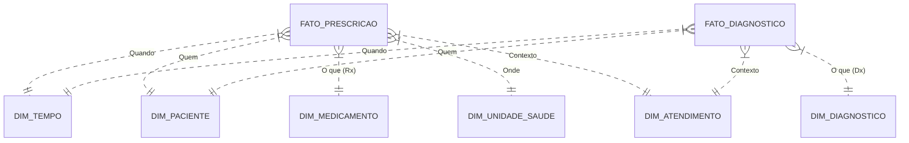

# Dicionário de Dados - Camada Gold (AMR Analytics)

**Destinatário**: Analistas de Dados / Desenvolvedores de Dashboard  
**Contexto**: Vigilância de Resistência Antimicrobiana (AMR) - Projeto CAMO-Net  
**Versão**: 1.0 (Draft)

---

## 1. Visão Geral do Modelo

O modelo de dados foi desenhado em **Star Schema** (Esquema Estrela) para facilitar análises de performance e usabilidade em ferramentas de BI (Power BI, Tableau, Metabase).

### Diagrama Conceitual

---

## 2. Tabelas Fato (Métricas)

### 💊 `fato_prescricao`
**Granularidade**: 1 linha = 1 medicamento prescrito em um atendimento.  
**Uso Principal**: Análise detalhada de consumo de antibióticos e adequação de prescrição.

| Coluna | Tipo | Descrição | Regra de Negócio |
|--------|------|-----------|------------------|
| `sk_prescricao` | Int | Chave primária | Surrogate Key |
| `quantidade` | Int | Qtd de unidades prescritas | - |
| `duracao` | Int | Duração do tratamento (dias) | - |
| `e_antibiotico` | Bool | É antibiótico? | Baseado em lista de compostos monitorados |
| `e_prescricao_apropriada` | Bool | Prescrição Adequada? | `True` se (É Antibiótico E Tem Diagnóstico Infeccioso) OU (Não É Antibiótico E Não Tem Diagnóstico Infeccioso) |
| `e_prescricao_inadequada` | Bool | Prescrição Inadequada? | Inverso da anterior. Foco em: Antibiótico prescrito sem diagnóstico infeccioso registrado. |
| `classe_who_aware` | String | Classificação WHO | Access, Watch, Reserve (via dimensão, desnormalizado aqui para performance se necessário, mas nativamente na dimensão) |

### 🦠 `fato_diagnostico`
**Granularidade**: 1 linha = 1 diagnóstico atribuído em um atendimento.  
**Uso Principal**: Perfil epidemiológico e morbidade.

| Coluna | Tipo | Descrição | Regra de Negócio |
|--------|------|-----------|------------------|
| `sk_diagnostico_atendimento` | Int | Chave primária | - |
| `e_diag_infeccioso` | Bool | É doença infecciosa? | Baseado em lista de CIDs/CIAPs monitorados |
| `diagnosticar_por` | String | Origem do código | 'CID' ou 'CIAP' |

### 🏥 `fato_atendimento_resumo`
**Granularidade**: 1 linha = 1 atendimento médico.  
**Uso Principal**: KPIs de alto nível, taxas de prescrição por consulta.

| Coluna | Tipo | Descrição |
|--------|------|-----------|
| `total_medicamentos_prescritos` | Int | Total de itens receitados na consulta |
| `total_antibioticos_prescritos` | Int | Total de antibióticos receitados |
| `total_diagnosticos_infecciosos` | Int | Qtd de diagnósticos infecciosos registrados |
| `teve_prescricao_antibiotico` | Bool | Flag facilitadora: Houve qualquer antibiótico? |
| `teve_diagnostico_infeccioso` | Bool | Flag facilitadora: Houve qualquer infecção? |

---

## 3. Dimensões (Contexto)

### 👤 `dim_paciente`
Perfil demográfico dos pacientes.
- `sexo`: M/F
- `idade_anos`: Idade no momento da extração.
- `faixa_etaria`: Agrupamento (0-1, 1-11, 12-17, 18-59, 60+).

### 💊 `dim_medicamento`
Catálogo de medicamentos padronizado.
- `composto_quimico`: Nome do princípio ativo (ex: AMOXICILINA).
- `classe_who_aware`: Classificação OMS (**Access**, **Watch**, **Reserve**). Crucial para Stewardship.
- `espectro_acao`: **Amplo** vs **Estreito**.
- `via_administracao`: Oral, Injetável, etc.

### 🩺 `dim_diagnostico`
Catálogo unificado de patologias (CID-10 e CIAP-2).
- `codigo_diagnostico`: Código oficial (ex: J01).
- `diag_original`: Descrição original do sistema.
- `e_infeccao`: Flag indicando se é alvo de vigilância AMR.

### 📅 `dim_tempo`
Calendário mestre.
- `data_completa`: Data do evento.
- `ano`, `mes`, `dia_semana`: Para análises de sazonalidade.
- `ano_mes`: Chave para gráficos de tendência (ex: '2023-01').

### 🏥 `dim_unidade_saude`
Locais de atendimento.
- `tipo`: UBS, USF, etc.
- `cod_unidade_saude`: Identificador anonimizado.

---

## 4. Exemplos de Perguntas de Negócio (KPIs)

**1. Qual a taxa de prescrição de antibióticos em casos de infecção?**
> Fórmula: `SUM(fato_atendimento_resumo.teve_prescricao_antibiotico)` onde `teve_diagnostico_infeccioso = True` / `COUNT(atendimentos com infecção)`

**2. Qual a adesão ao protocolo AWaRe (Access vs Watch)?**
> Análise: Distribuição de `dim_medicamento.classe_who_aware` filtrando apenas `fato_prescricao.e_antibiotico = True`.
> Meta: Maior proporção de 'Access' (verde) e menor de 'Watch' (amarelo).

**3. Onde estão as prescrições "inadequadas"?**
> Filtro: `fato_prescricao.e_prescricao_inadequada = True`.
> Quebrar por: `dim_unidade_saude` ou Especialidade (via `dim_atendimento`).

---

## 5. Observações Importantes para o Analista

1. **Granularidade**: Cuidado ao somar linhas da `fato_prescricao` para contar atendimentos. Use `COUNT(DISTINCT sk_atendimento)` ou use a `fato_atendimento_resumo`.
2. **Nulos**: Dimensões podem ter valores 'Não informado' ou -1 para preservar integridade referencial.
3. **Anonimização**: IDs de pacientes e unidades são hashes e não correspondem aos sistemas legados diretamente.
